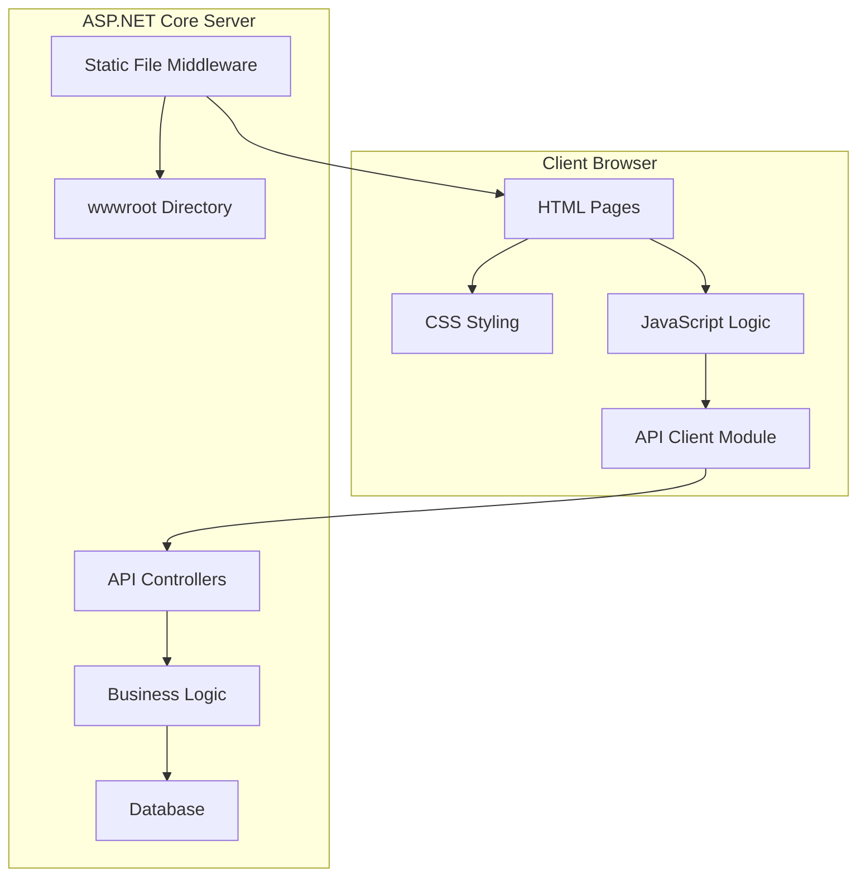

# Design Document: Shop Frontend

## Overview

The Shop Frontend is a simple, lightweight web application built with vanilla HTML, CSS, and JavaScript that provides a user-friendly interface for the existing Shop_ProjForWeb e-commerce API. The design prioritizes simplicity, maintainability, and direct integration with the existing backend without requiring complex build processes or framework dependencies.

The frontend will be served as static files from the ASP.NET Core application's wwwroot directory, allowing for seamless deployment and hosting alongside the existing API. This approach ensures minimal complexity while providing a fully functional e-commerce interface for both customers and administrators.

## Architecture

### High-Level Architecture



### Application Structure

The frontend follows a modular structure with separation of concerns:

- **Presentation Layer**: HTML templates and CSS styling
- **Logic Layer**: JavaScript modules for business logic and state management
- **Data Layer**: API client for backend communication
- **Routing Layer**: Simple client-side routing for navigation

### Technology Stack

- **HTML5**: Semantic markup and structure
- **CSS3**: Modern styling with Flexbox/Grid layouts and CSS custom properties
- **Vanilla JavaScript (ES6+)**: Modern JavaScript features without framework dependencies
- **Fetch API**: For HTTP requests to the backend API
- **Local Storage**: For client-side state persistence (shopping cart, user session)

## Components and Interfaces

### Core JavaScript Modules

#### 1. API Client Module (`js/api-client.js`)
Handles all communication with the backend REST API.

```javascript
class ApiClient {
    constructor(baseUrl = '/api') {
        this.baseUrl = baseUrl;
    }
    
    async get(endpoint, params = {}) { /* Implementation */ }
    async post(endpoint, data) { /* Implementation */ }
    async put(endpoint, data) { /* Implementation */ }
    async delete(endpoint) { /* Implementation */ }
}
```

**Key Methods:**
- Product operations: `getProducts()`, `getProduct(id)`, `searchProducts(name)`
- Order operations: `createOrder(data)`, `getOrders()`, `payOrder(id)`
- User operations: `getUsers()`, `createUser(data)`, `updateUser(id, data)`
- Inventory operations: `getInventory()`, `updateInventory(productId, data)`

#### 2. State Management Module (`js/state-manager.js`)
Manages application state and local storage operations.

```javascript
class StateManager {
    constructor() {
        this.state = {
            currentUser: null,
            cart: [],
            products: [],
            isAdmin: false
        };
    }
    
    setState(key, value) { /* Implementation */ }
    getState(key) { /* Implementation */ }
    persistState() { /* Implementation */ }
    loadState() { /* Implementation */ }
}
```

#### 3. Router Module (`js/router.js`)
Simple client-side routing for single-page application behavior.

```javascript
class Router {
    constructor() {
        this.routes = new Map();
        this.currentRoute = null;
    }
    
    addRoute(path, handler) { /* Implementation */ }
    navigate(path) { /* Implementation */ }
    handlePopState() { /* Implementation */ }
}
```

#### 4. UI Components Module (`js/components.js`)
Reusable UI components and rendering functions.

```javascript
class UIComponents {
    static createProductCard(product) { /* Implementation */ }
    static createOrderSummary(order) { /* Implementation */ }
    static createPagination(totalPages, currentPage) { /* Implementation */ }
    static showNotification(message, type) { /* Implementation */ }
}
```

### Page Controllers

#### 1. Product Catalog Controller (`js/pages/catalog.js`)
- Displays paginated product list with search functionality
- Handles product filtering and sorting
- Manages "Add to Cart" interactions

#### 2. Shopping Cart Controller (`js/pages/cart.js`)
- Displays cart contents with quantity modification
- Calculates totals including discounts
- Handles checkout process initiation

#### 3. User Account Controller (`js/pages/account.js`)
- User registration and profile management
- Order history display
- VIP status information

#### 4. Admin Dashboard Controller (`js/pages/admin.js`)
- Product management (CRUD operations)
- Inventory monitoring and updates
- Order management and processing

## Data Models

### Frontend Data Models

The frontend uses JavaScript objects that mirror the backend DTOs:

#### Product Model
```javascript
const Product = {
    id: 'string (GUID)',
    name: 'string',
    basePrice: 'number',
    discountPercent: 'number',
    isActive: 'boolean',
    imageUrl: 'string',
    createdAt: 'string (ISO date)'
};
```

#### Cart Item Model
```javascript
const CartItem = {
    productId: 'string (GUID)',
    productName: 'string',
    basePrice: 'number',
    discountPercent: 'number',
    quantity: 'number',
    subtotal: 'number'
};
```

#### User Model
```javascript
const User = {
    id: 'string (GUID)',
    fullName: 'string',
    isVip: 'boolean',
    createdAt: 'string (ISO date)'
};
```

#### Order Model
```javascript
const Order = {
    orderId: 'string (GUID)',
    userId: 'string (GUID)',
    totalPrice: 'number',
    status: 'number', // 0=Pending, 1=Paid, 2=Cancelled
    paidAt: 'string (ISO date)',
    items: 'Array<OrderItem>'
};
```

### API Integration Patterns

#### Request/Response Handling
- All API calls use the Fetch API with proper error handling
- Responses are validated and transformed to match frontend models
- Loading states are managed consistently across all operations
- Error messages are user-friendly and actionable

#### Pagination Support
```javascript
const PaginatedRequest = {
    page: 'number',
    pageSize: 'number',
    sortBy: 'string',
    sortDescending: 'boolean'
};

const PaginatedResponse = {
    items: 'Array<T>',
    totalCount: 'number',
    page: 'number',
    pageSize: 'number',
    totalPages: 'number',
    hasPreviousPage: 'boolean',
    hasNextPage: 'boolean'
};
```

## Correctness Properties

*A property is a characteristic or behavior that should hold true across all valid executions of a system-essentially, a formal statement about what the system should do. Properties serve as the bridge between human-readable specifications and machine-verifiable correctness guarantees.*

### Property Reflection

After analyzing all acceptance criteria, several properties can be consolidated to avoid redundancy:

- Properties about displaying required information (product details, cart contents, order details, etc.) can be combined into comprehensive display properties
- Properties about UI responsiveness to data changes can be unified
- Properties about form validation and API integration follow similar patterns

### Core Properties

#### Property 1: Product Display Completeness
*For any* product displayed in the interface, the rendered HTML should contain the product name, base price, discount percentage (if applicable), and image URL
**Validates: Requirements 1.2**

#### Property 2: Discount Price Display
*For any* product with a discount percentage greater than zero, the display should show both the original price and the calculated discounted price
**Validates: Requirements 1.3**

#### Property 3: Search Result Filtering
*For any* search query and product dataset, all returned results should have product names that contain the search term (case-insensitive)
**Validates: Requirements 1.4**

#### Property 4: Cart Item Storage
*For any* product added to the shopping cart, the cart state should contain an entry with the correct product ID, name, price, and selected quantity
**Validates: Requirements 2.1**

#### Property 5: Cart Display Completeness
*For any* cart with items, the cart view should display all items with their names, quantities, individual prices, and calculated subtotals
**Validates: Requirements 2.2**

#### Property 6: Cart Total Calculation
*For any* cart state, the displayed total should equal the sum of all item subtotals (quantity × price with discounts applied)
**Validates: Requirements 2.3**

#### Property 7: Cart Item Removal
*For any* item removed from the cart, the cart state should no longer contain that item and the total should be recalculated accordingly
**Validates: Requirements 2.4**

#### Property 8: API Order Creation
*For any* valid cart contents and user ID, the order creation should send a properly formatted request to the `/api/orders` endpoint with correct item data
**Validates: Requirements 3.2**

#### Property 9: VIP Discount Display
*For any* VIP user viewing order totals, the interface should display VIP discount information when applicable
**Validates: Requirements 3.5**

#### Property 10: User Status Display
*For any* authenticated user, the interface should display their VIP status consistently across all pages where user information appears
**Validates: Requirements 4.2, 4.5**

#### Property 11: Profile Information Completeness
*For any* user profile view, the displayed information should include full name, VIP status, account creation date, and complete order history
**Validates: Requirements 4.3**

#### Property 12: Profile Update Validation
*For any* profile update with valid data, the changes should be saved via API call and immediately reflected in the interface
**Validates: Requirements 4.4**

#### Property 13: Order History Completeness
*For any* user's order history, all orders should be displayed with their status, total price, and order date
**Validates: Requirements 5.1**

#### Property 14: Order Detail Display
*For any* order detail view, the displayed information should include all order items, quantities, prices, and the total amount
**Validates: Requirements 5.2**

#### Property 15: Pending Order Actions
*For any* order with pending status, the interface should provide both "Pay" and "Cancel" action buttons
**Validates: Requirements 5.3, 5.4**

#### Property 16: Status Update Responsiveness
*For any* order status change, the interface should immediately update the displayed status without requiring a page refresh
**Validates: Requirements 5.5**

#### Property 17: Admin Product Management
*For any* valid product data submitted through admin interface, the product should be created/updated via API and the product list should refresh
**Validates: Requirements 6.2, 6.3**

#### Property 18: Image Upload Handling
*For any* valid image file uploaded for a product, the file should be processed and the product's image URL should be updated
**Validates: Requirements 6.4**

#### Property 19: Product Status Management
*For any* product status change (activate/deactivate), the change should be saved via API and reflected in the admin product list
**Validates: Requirements 6.5**

#### Property 20: Low Stock Visual Indicators
*For any* product with inventory below the low stock threshold, the inventory display should include visual highlighting or warning indicators
**Validates: Requirements 7.2**

#### Property 21: Inventory Update Validation
*For any* inventory quantity update with a positive number, the change should be saved via API and the inventory display should update immediately
**Validates: Requirements 7.3**

#### Property 22: Inventory Display Completeness
*For any* inventory item, the display should show product name, current quantity, low stock status, and last update timestamp
**Validates: Requirements 7.4**

#### Property 23: Inventory Status Responsiveness
*For any* inventory quantity change that affects low stock status, the visual indicators should update immediately
**Validates: Requirements 7.5**

#### Property 24: Order Status Filtering
*For any* order status filter applied, only orders matching that status should be displayed in the results
**Validates: Requirements 8.2**

#### Property 25: Admin Order Detail Completeness
*For any* order viewed in admin interface, the display should include complete order information plus customer details
**Validates: Requirements 8.3**

#### Property 26: Payment Processing
*For any* order payment processed through admin interface, the order status should update to "Paid" and be reflected immediately
**Validates: Requirements 8.4**

#### Property 27: Order Statistics Accuracy
*For any* order dataset, the displayed statistics should accurately reflect order counts by status and recent activity metrics
**Validates: Requirements 8.5**

#### Property 28: Responsive Layout Adaptation
*For any* viewport width, the interface should adapt its layout to remain usable and readable on that screen size
**Validates: Requirements 9.1**

#### Property 29: Navigation Consistency
*For any* page navigation, the interface should maintain consistent navigation menus and provide appropriate breadcrumbs
**Validates: Requirements 9.2**

#### Property 30: Loading State Indication
*For any* API request in progress, the interface should display loading indicators to inform users of the ongoing operation
**Validates: Requirements 9.3**

#### Property 31: Error Handling with Recovery
*For any* API request failure, the interface should display user-friendly error messages and provide retry options where appropriate
**Validates: Requirements 9.4**

#### Property 32: Form Feedback Immediacy
*For any* form submission, the interface should provide immediate visual feedback indicating success or displaying validation errors
**Validates: Requirements 9.5**

#### Property 33: Data Change Responsiveness
*For any* data modification through the interface, the changes should be immediately visible in all relevant display areas
**Validates: Requirements 10.1**

#### Property 34: Network Failure Handling
*For any* network connectivity loss, the interface should inform users of the issue and queue actions when possible for later retry
**Validates: Requirements 10.3**

#### Property 35: Data Refresh Intervals
*For any* real-time data display (like inventory levels), the data should be refreshed at appropriate intervals to maintain accuracy
**Validates: Requirements 10.4**

#### Property 36: Cache Freshness Management
*For any* cached data, the cache should be invalidated and refreshed when the underlying data changes to prevent stale information
**Validates: Requirements 10.5**

## Error Handling

### Client-Side Error Handling

#### API Communication Errors
- **Network Failures**: Display user-friendly messages with retry options
- **HTTP Error Responses**: Parse error responses and show specific error messages
- **Timeout Handling**: Implement request timeouts with appropriate user feedback
- **Rate Limiting**: Handle rate limit responses gracefully with backoff strategies

#### Validation Errors
- **Form Validation**: Real-time validation with immediate feedback
- **Data Type Validation**: Ensure data types match expected formats before API calls
- **Business Rule Validation**: Client-side validation for business rules (e.g., positive quantities)
- **File Upload Validation**: Validate file types, sizes, and formats before upload

#### State Management Errors
- **Local Storage Failures**: Graceful degradation when local storage is unavailable
- **State Corruption**: Detect and recover from corrupted application state
- **Concurrent Modification**: Handle conflicts when multiple tabs modify the same data

### Error Recovery Strategies

#### Automatic Recovery
- **Retry Logic**: Automatic retry for transient network failures
- **State Restoration**: Restore application state from local storage on page reload
- **Cache Fallback**: Use cached data when fresh data is unavailable

#### User-Initiated Recovery
- **Manual Retry**: Provide retry buttons for failed operations
- **Data Refresh**: Allow users to manually refresh data when needed
- **State Reset**: Provide options to reset application state when corrupted

## Testing Strategy

### Dual Testing Approach

The frontend will be tested using both unit tests and property-based tests to ensure comprehensive coverage:

#### Unit Tests
Unit tests will focus on specific examples, edge cases, and integration points:
- **Component Rendering**: Test that components render correctly with specific data
- **User Interactions**: Test click handlers, form submissions, and navigation
- **API Integration**: Test API client methods with mock responses
- **Edge Cases**: Test empty states, error conditions, and boundary values
- **Browser Compatibility**: Test across different browsers and devices

#### Property-Based Tests
Property-based tests will verify universal properties across all inputs:
- **Data Display Properties**: Verify that all required information is always displayed
- **Calculation Properties**: Verify that price calculations are always correct
- **State Management Properties**: Verify that state changes are always consistent
- **API Integration Properties**: Verify that API calls are always properly formatted
- **UI Responsiveness Properties**: Verify that UI always updates when data changes

### Testing Framework Selection

For this vanilla JavaScript application, we will use:
- **Jest**: For unit testing with jsdom for DOM manipulation testing
- **fast-check**: For property-based testing in JavaScript
- **Cypress**: For end-to-end testing of complete user workflows

### Property Test Configuration

Each property-based test will:
- Run a minimum of 100 iterations to ensure comprehensive input coverage
- Use custom generators for domain-specific data (products, orders, users)
- Include proper shrinking to find minimal failing examples
- Be tagged with comments referencing the design document property

**Tag format**: `// Feature: shop-frontend, Property {number}: {property_text}`

### Test Organization

```
tests/
├── unit/
│   ├── api-client.test.js
│   ├── state-manager.test.js
│   ├── components.test.js
│   └── pages/
│       ├── catalog.test.js
│       ├── cart.test.js
│       ├── account.test.js
│       └── admin.test.js
├── property/
│   ├── display-properties.test.js
│   ├── calculation-properties.test.js
│   ├── state-properties.test.js
│   └── api-properties.test.js
└── e2e/
    ├── customer-workflow.spec.js
    └── admin-workflow.spec.js
```

### Testing Data Generation

Property tests will use generators for:
- **Product Data**: Random products with various prices, discounts, and statuses
- **User Data**: Random users with different VIP statuses and order histories
- **Order Data**: Random orders with various items, quantities, and statuses
- **Cart Data**: Random cart contents with different item combinations
- **API Responses**: Mock API responses with various success and error scenarios

The testing strategy ensures that both specific examples work correctly (unit tests) and that universal properties hold across all possible inputs (property tests), providing comprehensive validation of the frontend's correctness.